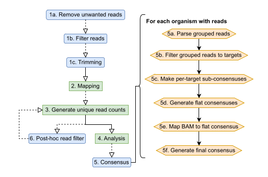

```
 _____           _                   _
/  __ \         | |                 | |
| /  \/ __ _ ___| |_ __ _ _ __   ___| |_
| |    / _` / __| __/ _` | '_ \ / _ \ __|
| \__/\ (_| \__ \ || (_| | | | |  __/ |_
 \____/\__,_|___/\__\__,_|_| |_|\___|\__|

O       o O       o O       o O       o O
| O   o | | O   o | | O   o | | O   o | |
| | O | | | | O | | | | O | | | | O | | |
| o   O | | o   O | | o   O | | o   O | |
o       O o       O o       O O       O o
```

Forked from https://github.com/tgolubch/castanet

Described in Mayne, R., Secret., S., Geoghegan, C., et al. (2024) Castanet: a pipeline for rapid analysis of targeted multi-pathogen genomic data (Preprint) https://doi.org/10.1101/2024.06.28.601013.

# [Documentation](https://github.com/MultipathogenGenomics/castanet/wiki)
Castanet documentation is hosted on our [GitHub Wiki Page](https://github.com/MultipathogenGenomics/castanet/wiki)
## [Installation](https://github.com/MultipathogenGenomics/castanet/wiki/Installation)
## [Quick start](https://github.com/MultipathogenGenomics/castanet/wiki/Quickstart)
## [Usage](https://github.com/MultipathogenGenomics/castanet/wiki/Usage)
## [Output file interpretation](https://github.com/MultipathogenGenomics/castanet/wiki/Output)
## [Guide for contributors](https://github.com/MultipathogenGenomics/castanet/wiki/Contributors)


# Castanet workflow


Dotted lines indicate optional pipeline stages.

# Changelog
## Version 7, 19/08/24
1. Docker support
1. PyTest suite (80% cov)
1. Wiki creation
1. Deprecated original CLI and eval tools (supplanted by current version)

## Version 6, 02/07/24
1. Castanet "lite" - simplified CLI added
1. Full CLI tool test suite
1. Updated readme

## Version 5, 07/03/24
1. Additional workflow for analysing pre-mapped bam files
1. Simplified all workflows by automatic inference of sequence/bam files in input folders
1. Dependency check endpoint
1. Expanded exception catching and logging
1. Updated installer and readme
1. Added parameterisation for n threads, do trimming, do kraken prefilter
1. Various bug fixes
1. Updated dependency installer and various dependency calls to enhance compatibility with Mac M1/M2

## Version 4, 17/11/23
1. Support for outputting intermediate files from consensus generation, for downstream analysis
1. Support for single ended read sets
1. Installer scripts modified to allow for more minimal linux builds and newer dependency versions (htslib/viral_consensus)
1. Aggregation function regular expressions modified for BACT-containing probe names
1. Deprecated requirement for inputting probes csv file; now inferred from refstem
1. Various error handler improvements

## Version 3, 12/09/23
1. Refinement of consensus generator functions; addition of user-tunable threshold parameters, fix for long terminal gaps, expanding range of statistics reported, error handling, refactoring etc.
1. Migration of plotting engine to Plotly
1. Build script and dataset generation automation
1. Panel converter endpoint with overhaul of string aggregation; finer control over sub-group reporting
1. Function for trimming terminal gaps, which may appear as an artefact of Mafft reference alignments
1. Various bug fixes

## Version 2, 28/07/23
1. Added consensensus calling functions
1. Added evaluation of consensus sequence functions
1. Experiment result folder creation and persisitent file storage overhauled
1. Various optimizations
1. Readme updated

## Version 1, 14/06/23
1. Python scripts naturalised to Python3
1. Project and working directory structure
1. Dependency installer shell script
1. Experiment directory management functions
1. Refresh example experiment in readme to fit end to end workflow script
1. Python scripts adapted to OOP practices for security and speed
1. Unified API with end-to-end workflow endpoint
1. Git hooks for contributors
1. Containerization

# Disclaimer
The material embodied in this software is provided to you "as-is", “with all faults”, and without warranty of any kind, express, implied or otherwise, including without limitation, any warranty of fitness for a particular purpose, warranty of non-infringement, or warranties of any kind concerning the safety, suitability, lack of viruses, inaccuracies, or other harmful components of this software. There are inherent dangers in the use of any software, and you are solely responsible for determining whether this software is compatible with your equipment and other software installed on your equipment. You are convert_fasta_to_genbankalso solely responsible for the protection of your equipment and backup of your data, and the developers/providers will not be liable for any damages you may suffer in connection with using, modifying, or distributing this software. Without limiting the foregoing, the developers/providers make no warranty that: the software will meet your requirements; the software will be uninterrupted, timely, secure, or error-free; the results that may be obtained from the use of the software will be effective, accurate, or reliable; the quality of the software will meet your expectations; any errors in the software will be identified or corrected.

Software and its documentation made available here could include technical or other mistakes, inaccuracies, or typographical errors. The developers/providers may make changes to the software or documentation made available here may be out of date, and the developers/providers make no commitment to update such materials.

The developers/providers assume no responsibility for errors or omissions in the software or documentation available from here.

In no event shall the developers/providers be liable to you or anyone else for any direct, special, incidental, indirect, or consequential damages of any kind, or any damages whatsoever, including without limitation, loss of data, loss of profit, loss of use, savings or revenue, or the claims of third parties, whether or not the developers/providers have been advised of the possibility of such damages and loss, however caused, and on any theory of liability, arising out of or in connection with the possession, use, or performance of this software.

The use of this software is done at your own discretion and risk and with agreement that you will be solely responsible for any damage to your computer system, or networked devices, or loss of data that results from such activities. No advice or information, whether oral or written, obtained by you from the developers/providers shall create any warranty for the software.
