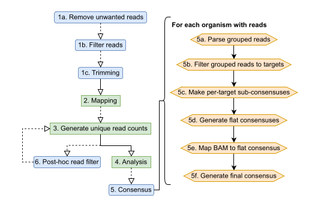

<!-- ```
 _____           _                   _
/  __ \         | |                 | |
| /  \/ __ _ ___| |_ __ _ _ __   ___| |_
| |    / _` / __| __/ _` | '_ \ / _ \ __|
| \__/\ (_| \__ \ || (_| | | | |  __/ |_
 \____/\__,_|___/\__\__,_|_| |_|\___|\__|

O       o O       o O       o O       o O
| O   o | | O   o | | O   o | | O   o | |
| | O | | | | O | | | | O | | | | O | | |
| o   O | | o   O | | o   O | | o   O | |
o       O o       O o       O O       O o
``` -->
<p align="center">

</p>
Described in Mayne, R., Secret., S., Geoghegan, C., et al. (2024) Castanet: a pipeline for rapid analysis of targeted multi-pathogen genomic data. Bioinformatics, btae591. https://doi.org/10.1093/bioinformatics/btae591

<a href="https://hub.docker.com/r/mayne941/castanet"> Try Castanet with Docker @ DockerHub</a>

# New in V9.3
1. Aggregation to rMLST genes has been re-implemented using the new mapping reference table scheme. See Wiki for more details.
1. Explicit error handling added to several pipeline stages. This will now provide users with feedback from CLI tool calls as well as Castanet.
1. Mapping ref table converter now has option to fix mapping ref files of common errors.
1. Bug fixes:
    * Mafft version pinned to 7.505 to avoid segfaults in some edge cases
    * Removed unnecesasry double filtering in postfilt function
    * Consensus sequence header bug with double ">" fixed
    * Groupedreads.p is now deleted from the user's experiment archives unless debug mode is enabled, to save drive space

# [Documentation](https://github.com/MultipathogenGenomics/castanet/wiki)
Castanet documentation is hosted on our [GitHub Wiki Page](https://github.com/MultipathogenGenomics/castanet/wiki)
## [Installation](https://github.com/MultipathogenGenomics/castanet/wiki/Installation)
## [Quick start](https://github.com/MultipathogenGenomics/castanet/wiki/Quickstart)
## [Usage](https://github.com/MultipathogenGenomics/castanet/wiki/Usage)
## [Making a mapping reference](https://github.com/MultipathogenGenomics/castanet/wiki/References)
## [Output file interpretation](https://github.com/MultipathogenGenomics/castanet/wiki/Output)
## [Advanced usage options](https://github.com/MultipathogenGenomics/castanet/wiki/Advanced)
## [Guide for contributors](https://github.com/MultipathogenGenomics/castanet/wiki/Contributors)
## [Troubleshooting](https://github.com/MultipathogenGenomics/castanet/wiki/Troubleshooting)

# Castanet workflow


Dotted lines indicate optional pipeline stages.

# Changelog
# Version 9, 21/08/25
##### N.b. if upgrading an existing installation, users will need to install minimap2 to their Castanet Conda environment manually!
##### $ conda install -c bioconda -y minimap2
1. Users may now supply mapping references in any format, and fine-tune them with the /convert_mapping_reference/ funciton. See [Making a mapping reference](https://github.com/MultipathogenGenomics/castanet/wiki/References) for more details.
1. Additional CLI support for Nanopore workflows
1. Additional support for ONT users
    * Option to use Minimap2 as mapper
    * Utility function for concatenating all .fastq.gz files in a directory to a single, Castanet-compatible file
1. Mapping reference file checks are now completed at the start of each run, and users are alerted if common issues are found
1. Additional details from stderr written to terminal in errors
1. Bug fixes
    * Fixed an issue where Kraken2 wouldn't run properly in the filtering pipeline step when nested save directories were used.
    * Interim unzipped fastq files are now not created and left in experiment directories when using Minimap2.
    * Extra error handling for consensus generation issues where third party CLI tools are called.
    * Non-Castanet-compliant mapping reference headers would cause failure to generate consensus sequences
    * Using bowtie2 as mapper would create cosnensus sequences with unusual names
    * Running multiple Castanet jobs in parallel via CLI could cause issues with re-indexing the refstem
    * Added error handling to prevent users from inserting non-printable characters in API arguments
    * Summary statistics for batch runs now aggregate correctly in nested folders
    * Fix for bug using postfilt option in batch mode
1. Docker container updated with latest version
1. Consensus algorithm enhancements to give more representative results with highly diverse/recombination-prone viruses
1. Post filter option for removing uniquely-mapping reads (uses include removal of index hopping reads)
1. BAM parsing enhancements for compute time and memory footprint.
1. Parameterised "debug mode", where if False no intermediate files are generated (cleaner output to save space, esp. for use on shared infrastructure)
1. Test suite updates
1. Extensions to consensus generator algorithm to allow for greater precision in deconvolving similar sequences
1. Mapping reference creator now has extended functionality and user guidance
1. Docker container refresh with simplified build
1. Additional CLI support for new mapping ref scheme functions (thanks @mjohnpayne)
1. Extended support for ONT users
1. Wiki updates


## Version 8, 20/12/24
1. Added user option to map with bowtie2, in addition to BWA-mem2
1. Troubleshooting section added to Wiki
1. Additional optional arguments added to Castanet lite (CLI)
1. Security and compatibility updates for modules: pydantic, fastapi, pandas, numpy
1. Bug fixes:
    * Infile hashing now works as expected on amplicon pipeline
    * Batch mode will now ignore non-directory items in a folder, rather than explictly calling an error
    * Fixed issue where end of batch run summary files would fail to save, if input files and output directory were at different levels of directory nesting
    * Fixed issue where Kraken2 call wasn't working for some users who had pre-existing installations in their PATH
    * User guidance on running Castanet lite (CLI) fixed with correct path
1. Bowtie2 support extended in Consensus module
1. Parameterised Consensus enable/disable terminal trim (ConsensusTrimTerminals)
1. Expanded range of output statistics for Consensus module
1. Test suite updated
1. Additional support for Nanopore/single ended read users
1. Name of headers in consensus sequences now reflects sample name, organism type and minimum depth
1. Copies of consensus sequences are now saved to ./{experiment directory}/consensus_sequences/, to make them easier to find
1. Mac user and bacterial target support enhancements (thanks @mjohnpayne)
1. Test suite expanded to 80% coverage


## Version 7, 19/08/24
1. Docker support
1. PyTest suite (80% cov)
1. Wiki creation
1. Deprecated original CLI and eval tools (supplanted by current version)

## Version 6, 02/07/24
1. Castanet "lite" - simplified CLI added
1. Full CLI tool test suite
1. Updated readme

## Version 5, 07/03/24
1. Additional workflow for analysing pre-mapped bam files
1. Simplified all workflows by automatic inference of sequence/bam files in input folders
1. Dependency check endpoint
1. Expanded exception catching and logging
1. Updated installer and readme
1. Added parameterisation for n threads, do trimming, do kraken prefilter
1. Various bug fixes
1. Updated dependency installer and various dependency calls to enhance compatibility with Mac M1/M2

## Version 4, 17/11/23
1. Support for outputting intermediate files from consensus generation, for downstream analysis
1. Support for single ended read sets
1. Installer scripts modified to allow for more minimal linux builds and newer dependency versions (htslib/viral_consensus)
1. Aggregation function regular expressions modified for BACT-containing probe names
1. Deprecated requirement for inputting probes csv file; now inferred from refstem
1. Various error handler improvements

## Version 3, 12/09/23
1. Refinement of consensus generator functions; addition of user-tunable threshold parameters, fix for long terminal gaps, expanding range of statistics reported, error handling, refactoring etc.
1. Migration of plotting engine to Plotly
1. Build script and dataset generation automation
1. Panel converter endpoint with overhaul of string aggregation; finer control over sub-group reporting
1. Function for trimming terminal gaps, which may appear as an artefact of Mafft reference alignments
1. Various bug fixes

## Version 2, 28/07/23
1. Added consensensus calling functions
1. Added evaluation of consensus sequence functions
1. Experiment result folder creation and persisitent file storage overhauled
1. Various optimizations
1. Readme updated

## Version 1, 14/06/23
1. Python scripts naturalised to Python3
1. Project and working directory structure
1. Dependency installer shell script
1. Experiment directory management functions
1. Refresh example experiment in readme to fit end to end workflow script
1. Python scripts adapted to OOP practices for security and speed
1. Unified API with end-to-end workflow endpoint
1. Git hooks for contributors
1. Containerization

# Disclaimer
The material embodied in this software is provided to you "as-is", “with all faults”, and without warranty of any kind, express, implied or otherwise, including without limitation, any warranty of fitness for a particular purpose, warranty of non-infringement, or warranties of any kind concerning the safety, suitability, lack of viruses, inaccuracies, or other harmful components of this software. There are inherent dangers in the use of any software, and you are solely responsible for determining whether this software is compatible with your equipment and other software installed on your equipment. You are convert_fasta_to_genbankalso solely responsible for the protection of your equipment and backup of your data, and the developers/providers will not be liable for any damages you may suffer in connection with using, modifying, or distributing this software. Without limiting the foregoing, the developers/providers make no warranty that: the software will meet your requirements; the software will be uninterrupted, timely, secure, or error-free; the results that may be obtained from the use of the software will be effective, accurate, or reliable; the quality of the software will meet your expectations; any errors in the software will be identified or corrected.

Software and its documentation made available here could include technical or other mistakes, inaccuracies, or typographical errors. The developers/providers may make changes to the software or documentation made available here may be out of date, and the developers/providers make no commitment to update such materials.

The developers/providers assume no responsibility for errors or omissions in the software or documentation available from here.

In no event shall the developers/providers be liable to you or anyone else for any direct, special, incidental, indirect, or consequential damages of any kind, or any damages whatsoever, including without limitation, loss of data, loss of profit, loss of use, savings or revenue, or the claims of third parties, whether or not the developers/providers have been advised of the possibility of such damages and loss, however caused, and on any theory of liability, arising out of or in connection with the possession, use, or performance of this software.

The use of this software is done at your own discretion and risk and with agreement that you will be solely responsible for any damage to your computer system, or networked devices, or loss of data that results from such activities. No advice or information, whether oral or written, obtained by you from the developers/providers shall create any warranty for the software.
