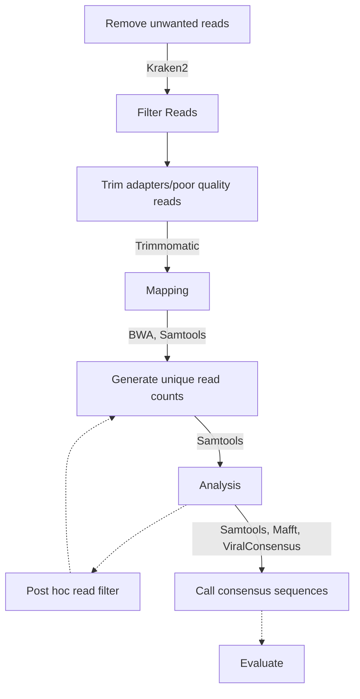

```
 _____           _                   _
/  __ \         | |                 | |
| /  \/ __ _ ___| |_ __ _ _ __   ___| |_
| |    / _` / __| __/ _` | '_ \ / _ \ __|
| \__/\ (_| \__ \ || (_| | | | |  __/ |_
 \____/\__,_|___/\__\__,_|_| |_|\___|\__|

O       o O       o O       o O       o O
| O   o | | O   o | | O   o | | O   o | |
| | O | | | | O | | | | O | | | | O | | |
| o   O | | o   O | | o   O | | o   O | |
o       O o       O o       O O       O o
```

Forked from https://github.com/tgolubch/castanet, originally described in https://doi.org/10.1101/716902

This implementation is written in Python 3 and has additional convenience features, such as end-to-end workflows, optimizations, automated installation of dependencies, an API and wider suite of features, including consensus sequence generator.

# Castanet workflow

Dotted lines indicate optional pipeline stages. Calls to dependencies are annotated.

# Installation
## Prerequisites
We assume the user's system is set up with the following. See attached links for guidance if not.
1. A Linux-like environment: tested on Ubuntu 22.04 and Windows Subsystems Linux (WSL2) Ubuntu 22.04. User experience with Windows/Mac will vary.
1. Conda (for managing packages). See https://docs.conda.io/projects/conda/en/latest/user-guide/install/linux.html
1. Python > 3.7 <= 3.12 (developed for 3.10), ideally installed specifically to a Conda environment made for running Castanet.
1. Java runtime environment (for running external dependency, Trimmomatic). On Debian-based Linux, install with   ```$ sudo apt install default-jre```, then check installation was successful with ```$ java -version```. On other platforms, see https://www.java.com/en/download/manual.jsp

## Environment setup
We strongly recommend creating a new Conda environment for your Castanet install:

```$ conda create --name castanet python==3.10```

Which can be activated with:

```$ conda activate castanet```

Before installing your pip libraries:

```$ pip install -r requirements.txt```

And the following Command Line packages:

```$ sudo apt update -y```

```$ sudo apt install -y samtools unzip make libbz2-dev libcurl4-openssl-dev liblzma-dev g++ automake bzip2 gcc wget zlib1g-dev```

(N.b. if any of the above commands fail, try ```$ sudo apt --fix-broken install```)

Then these bioinformatics dependencies:
```$ bash install_deps.sh```

(Optional: alias the command to start a Castanet server; if doing on Mac, sub "bashrc" for "zshrc")

```$ echo "alias castanet='conda activate castanet && uvicorn app.api:app --reload --port 8001'" >> ~/.bashrc```

```$ source ~/.bashrc```

# Quick-start
## GUI (Recommended)
1. Install dependencies (see above)
1. Start an API server with ```$ castanet``` (or ```$ uvicorn app.api:app --port 8001``` if you haven't created an alias command). Check that the Castanet startup message appears in your terminal window.
1. Open your favourite web browser and visit following address for the Castanet GUI ```http://127.0.0.1:8001/docs```.
1. Scroll down to find the green "check_dependencies" box and click on it to expand. Chick "Try it out" (top right corner of green box), then the blue "Execute" box that appears underneath. This will test that all of the dependencies needed for Castanet to run are installed and functioning as expected. Check the output in either the Terminal or the API window (might need to scroll down) to ensure it completes successfully.
1. Expand green drop-down for end_to_end endpoint. Click "Try it out" button (top right of expanded green boxes). Copy-paste command string below, trigger the function with "Execute" button. This triggers an end-to-end run analysing a synthetic dataset that's included in this repository. Output are saved to ./experiments/CastanetTest/.

```
{
  "ExpDir": "./data/eval/",
  "ExpName": "CastanetTest",
  "RefStem": "data/eval/ref.fa",
  "SingleEndedReads": false,
  "DoTrimming": true,
  "TrimMinLen": 36,
  "ConsensusMinD": 10,
  "ConsensusCoverage": 30,
  "ConsensusMapQ": 1,
  "ConsensusCleanFiles": true,
  "GtFile": "",
  "GtOrg": "",
  "DoKrakenPrefilter": false,
  "LineageFile": "data/ncbi_lineages_2023-06-15.csv.gz",
  "ExcludeIds": "9606",
  "RetainIds": "",
  "RetainNames": "",
  "ExcludeNames": "Homo",
  "KrakenDbDir": "kraken2_human_db/",
  "KeepDups": true,
  "Clin": "",
  "DepthInf": "",
  "SamplesFile": "",
  "PostFilt": false,
  "AdaptP": "data/all_adapters.fa",
  "NThreads": "auto"
}
```

N.b. pay attention to your argument type: strings should be encased in double quotes, whereas numbers and booleans (true, false) don't need to be. Any arguments that default to empty ('"ArgName": ""') are optional and may be left blank. The API will give you error messages in the "response body" box in your web browser, and detailed error messags will be printed to the terminal.

## Command line
1. Complete steps 1--2 in the "GUI" section, above.
1. Test that all of the dependencies needed for Castanet to run are installed and functioning as expected by hitting cURL'ing the check_dependencies endpoint (example script included: ```$ bash dev/check_dependencies.sh```). Check the output in either the Terminal or the API window (might need to scroll down) to ensure it completes successfully.
1. Try an end-to-end run analysing a synthetic dataset that's included in this repository, by cURL'ing the end_to_end endpoint (example script included: ```$ bash dev/end_to_end.sh```). Output are saved to ./experiments/CastanetTest/.

# Parameter descriptions
All parameter descriptions with data typing can be found in the GUI: follow steps 1--3 in "GUI" section (above), then scroll down to "Schemas" section; boxes can be expanded to show details for data schema for each endpoint.
## /end_to_end/
```
{
  "ExpDir": Folder containing your input data. Castanet expects this folder to contain only 2 files, i.e. your paired reads, in .fastq/.fastq.gz format.
  "ExpName": Run designation; your output folder will have this name.
  "RefStem": Path to file containing mapping references, in .fasta format
  "DoTrimming": If true, run trimmomatic to remove adapters and low quality reads.
  "TrimMinLen": Inserts smaller than this number will be trimmed by Trimmomatic, if "DoTrimming": true.
  "ConsensusMinD": Minimum read depth required for Castanet to attempt to generate a consensus sequence, across a coverage breadth defined in "ConsensusCoverage".
  "ConsensusCoverage": Minimum coverage breadth required for Castanet to attempt to generate a consensus sequence, at a read depth defined in "Consensus Coverage".
  "ConsensusMapQ": Minimum map quality (Phred) required for a read to be included in a Castanet consensus sequence.
  "ConsensusCleanFiles": If true, Castanet will delete the BAM file created for an experiment once it's finished generating consensus sequences. Enable this to save storage space.
  "AdaptP": Location of your Trimmomatic adapter sequences - may be in your Trimmomatic path, but a backup is included in the data dir.
  "NThreads": Specify the number of threads for multi-core processing. Options: integer == this many threads; 'auto' == let Castanet choose number of threads; 'hpc' == select when running on a compute cluster (hard codes to 1).
  "DoKrakenPrefilter": If true, run an initial filter step using Kraken2 for removing reads assigned to specific species.
  "LineageFile": File path to NCBI lineage file, which is used in combination with "DoKrakenPreFilter" to label and filter reads associated with specific species. This should be downloaded automatically as part of the Castanet installation.
  "ExcludeIds": (Optional) Used in combination with "DoKrakenPreFilter", NBCI TaxIDs to exclude.
  "RetainIds": (Optional) Used in combination with "DoKrakenPreFilter", NBCI TaxIDs to retain.
  "RetainNames": (Optional) Used in combination with "DoKrakenPreFilter", species names to retain.
  "ExcludeNames": (Optional) Used in combination with "DoKrakenPreFilter", species names to exclude.
  "KrakenDbDir": Directory path to database for Kraken2 database, used in combination with "DoKrakenPreFilter". A small database for labelling human reads should be automatically downloaded by the Castanet installation script.
  "KeepDups": If true, Castanet will not filter duplicated reads. Users are strongly recommended to keep this enabled.
  "Clin": (OPTIONAL) Path to CSV file containing clinical data (must have at least following fields: pt, clin_int; the field "sampleid" if present will be ignored). Other fields will be ignored.
  "DepthInf": (OPTIONAL, For regenerating full CSV with new clinical info): Path to previously generated CSV file of read depth per position for each probe, for all samples in this batch.
  "SamplesFile": (OPTIONAL) If specified, read raw read numbers from this CSV (needs cols 'sampleid', 'pt', 'rawreadnum'). If not specified, CASTANET will read the raw read numbers from the input bam file, i.e. it will assume you haven't pre-filtered the file.
  "PostFilt": If true, post hoc filter BAM file to remove reads marked as contamination.
  "SingleEndedReads": Experimental feature for non-paired read sets. Recommend to leave as: false.
  "GtFile": (Optional) Used to specify a CSV file containing at least columns: Primary_accession and GenBank_accession, for evaluating consensus seqs vs ground truth.
  "GtOrg": (Optional) Name of target organism to measure ground truth sequence against.

}
```

# Generating custom probe files

Castanet works by aggregating reads on target at the organism level, which is achieved through filtering probe names. It's critical that your probe nomenclature is compatible with Castanet, otherwise aggregation to specific orgaisms will fail during the "Analysis" script.

Ideally probe names will be in the format:

```>Genus_species_....```

E.g.:
```
>hbv_10407_cluster0
ATCG..
>treponema_pallidum_bact000001
ATCG..
>haemophilus_influenzae_bact000016_haemophilus-19_influenzae-16-parainfluenzae
ATCG..
```

Castanet can also process several standard formats, where rMLST gene names (i.e. bactXX) are optional (LOWER CASE TRANSFORMED):
1. ```bact[0-9]+_([A-Za-z]+)-[0-9]+[|_]([A-Za-z]+)```
1. ```bact[0-9]+_[0-9]+_([A-Za-z]+_[A-Za-z_]+)```
1. ```bact[0-9]+_([a-z]+_[a-z_]+)```

Your probe panel will be unique to your experiments, hence we have not provided one. We thoroughly recommend running Castanet's /convert_mapping_reference/ endpoint to aid in creating a Castanet-compatible file:

1. Source your multi-fasta mapping reference.
1. Start the Castanet server and visit the GUI (steps 1--3 in "GUI" section, above).
1. Find the /convert_mapping_reference/ box and expand it. Click "try it out" to enable the dialogue box.
1. Fill in the parameters according to the schema below (n.b. maintain inverted commas and commas).
1. Hit "Execute". Check the terminal for notifications if there are any errors in your probe names that Castanet can't correct.

```
{
  "InputFolder": Directory containing your input fasta(s).
  "OutFolder": Directory path to save your output mapping reference.
  "OutFileName": Name for output file.
}
```

Try to avoid non-alphanumeric characters in your probe names, although the /convert_probes/ endpoint filters most types of contaminating character (underscores, hyphen, pipes etc.).


## Prerequisite files
Castanet supports a variety of workflows and will require the user to supply their own data, either as a pair of read files in .fq/.fastq[.gz] format, or otherwise a pre-made bam file. Depending on which workflow is triggered, the software works by looking for files inside a user-specified folder ("ExpDir", via the API): if an end-to-end workflow, or individual steps therein, are triggered, Castanet will look for 2x read files in this folder. If you trigger an analysis of a bam file, it will instead look for a single bam file in this folder.

Users may provide the following data to use Castanet:
1. A collection of fasta sequences that comprise the user's probe set, with a naming convention compatible with Castanet (see section "Supported probe formats")
1. (Optional) A CSV file describing the total number of reads from your original, unedited input files. Columns should include: "sampleid" (i.e. mysample_1...), "pt" to link to clinical data (if present, otherwise leave blank) and "rawreadnum". If not present, Castanet will assume that your input fasta has not been filtered and hence, will infer the max n reads from these.
1. (Optional) A CSV file containing clinical metadata, which may be joined to output statistics via the "pt" key (see above).

All other pre-requisites can be generated by Castanet and associated automation scripts.


# Function descriptions
## Input arguments common to multiple functions
1. Experiment directory [ExpDir]. Folder where your input files live: Castanet will look for .fastq/.fq or .bam files, depending on which function you've called.
1. Experiment name [ExpName]. Folder where data is stored and may be saved.
1. Threads [NThreads]. Number of individual processes to be run concurrently.

## Preprocess
Calls Kraken2, which is a command line tool for doing taxonomic classification using exact k-mer matches, to identify human (genomic and mitochondrial) raw reads, as well as common contaminants. Output are called in the next pipeline step and removed prior to analysis. For more details, see ```https://ccb.jhu.edu/software/kraken2/```

*Input args*
1. Kraken database directory [KrakenDbDir] (set up automatically through running ```install_deps.sh```).

*Output*
1. {ExpDir}{SeqName}_1.kraken. Kraken2 output file.

## Filter keep reads
Calls Castanet FilterKeepReads class, which makes lists of reads from raw sequences, identified via Kraken2, that are to be retained or removed. There are user-specified options for expanding these rules, through comparison with an input file of lineages. Users may generate such a file, see below: Dependency notes > Lineage file. Final step is to do the filter and save the output to a compressed fastq file.

*Input args*
1. (Optional) Lineage file [LineageFile], in .csv or .gz format. N.b. user is expected to supply the directory and file extension.
1. (Optional) Exclude IDs [ExcludeIds]. NCBI TaxIDs from lineage file to exclude from analysis. Recommend to use default TaxID 9606 (human).
1. (Optional) Retain IDs [RetainIds]. NCBI TaxIDs from lineage file to retain in analysis.
1. (Optional) List of names to exclude [ExcludeNames]. Taxonomic names to exclude, which are searched for in the input lineage file and converted into TaxIDs. Must be a comma separated list with no spaces.
1. (Optional) List of names to retain [RetainNames]. Taxonomic names to retain, which are searched for in the input lineage file and converted into TaxIDs. Must be a comma separated list with no spaces.

*Output*
1. Filtered sequence files: {ExpDir}{SeqName}_[12]_filt.fastq

## Trim data
Uses Trimmomatic to remove low quality reads and sequencer adapters. We assume this tool will be installed as described in the automated installer script, in particular with regard to version and directory, as these are hard-coded in the call (in app/src/trim_adapters.py). Input files are filtered *_filt.fasta.gz from previous stage, and output are trimmed versions of the input in addition to separate (temp) files containing the trimmings.

*Input args*
1. Adapters file [AdaptP]: Path to .fa file containing adapter sequences. For convenience, we have included a file in the /data/ directory containing several commonly-used adapters, but the Trimmomatic tool will also download a number of individual files specific to sequencing technique in its root directory.

*Output*
1. Trimmed files: {ExpDir}{SeqName}_[12]_clean.fastq
1. Trimmings files: {ExpDir}{SeqName}_[12]_trimmings.fastq

## Map reads to reference
Uses BWA algorithm to map reads against reference sequences. Initial step is to index the reference .fasta file (not included!), after which mem function is used to map your cleaned input sequences against the indexed references. Samtools are then used to map the output to the shell, which are then sorted and saved as a compressed alignment map (*.bam) file.

*Input args*
1. Reference sequence file [RefStem]. Reference sequences in .fasta format. Include full file path and extension.

*Output*
1. Compressed alignment map file: {ExpDir}{SeqName}.bam

## Generate counts
Iterate over bam files in your experiment directory (N.b. this is a batching function! Ensure you know which files are present in this directory before using!), decrypt to SAM format and print to terminal; output are piped directly to Castanet parse_bam functions to produce a CSV file containing position counts. Parse BAM functions are multi functional - this entrypoint specifies to do only the "parse" functions, which generate counts for uniquely mapped sequences identified. Functions can differentiate between properly paired matches (with a suitably-long match length) and badly paired but sufficiently long sequence match.

*Input args*
(No non-generic input)

*Output*
1 CSV file containing counts: {ExpDir}PosCounts.csv

## Analysis

*Input args*
1. Sample mapping file [Samples]. CSV file containing information about raw reads, with headers {sampleid,pt,rawreadnum}. Field "pt" must match clinical data, if specified.
1. (OPTIONAL) Clinical data file [Clin]. CSV contianing clinical details, which may be mapped to samples via Samples file pt field.
1. (OPTIONAL) Path to previously generated file containing read depts [DepthInf]. Used for regenerating full CSV of results with clinical info. Must contain headers {sampleid,
                        target_id, depth_mean, depth_std, depth_25pc,
                        depth_median, depth_75pc, prop_target_covered,
                        prop_target_covered_mindepth2,
                        prop_target_covered_mindepth5,
                        prop_target_covered_mindepth10, udepth_mean,
                        udepth_std, udepth_25pc, udepth_median, udepth_75pc,
                        uprop_target_covered, uprop_target_covered_mindepth2,
                        uprop_target_covered_mindepth5,
                        uprop_target_covered_mindepth10}.

*Output*
1. Directory of coverage plots: Depth_{ExpName}
1. Number and proportion of reads for each sample and reference: {ExpName}_depth.csv. (Positives may need to be calibrated against a reference set, but in general, the proportion of all clean reads that match the given target (clean_prop_of_reads_on_target) is a good place to start.)
1. File containing reads to drop for post filter removal of misassigned reads: {ExpName}_reads_to_drop.csv.

## Post filter
Output of analysis (misassigned reads) may be used to post (downstream) filter input BAM file. Uses Samtools to decode and parse contents of BAM file, which are piped to Casta parse_bam functions (ONLY filter functions).

*Input args*
(No non-generic input)

*Output*
1. Compressed alignment map file: {ExpDir}{SeqName}.bam

## Consensus
Details to follow, after publication of accompanying method.

## Evaluate
Details to follow, after publication of accompanying method.

# Dependency notes
The included `install_deps.sh` script will attempt to install the following dependencies automatically. Depending on your specific system set-up, manual installation of some or all components may still be required. Details are included below.

## Lineage file
We have included a lineage file in the repo for convenience. Users may generate up-to-date files using the repository below.

``` https://github.com/zyxue/ncbitax2lin  ```

## Mapper
Mapping is an essential process to Castanet, which involves comparing our experiment reads with a number of pre-defined reference sequences. We opt for bwa-mem2 for doing Burrows Wheeler alignment.

```https://github.com/bwa-mem2/bwa-mem2```

Castanet is not tested with original bwa, bowtie2 etc., but may be compatible.

## Samtools
Samtools is a collection of software libraries that provides a range of functions for interrogating NGS data, specifically in Sequence Alignment Map (SAM) format and the compressed Binary- (BAM) format. These functions include reading, writing and viewing the contents of these files.

```http://www.htslib.org/```

## Trimmomatic
Trimming is an essential quality control process for removing sequence fragments that would contaminate our analyses. Specifically, we use Trimmomatic here to remove both low quality reads and our Illumina adapters (via MINLEN and ILLUMINACLIP functions).

```http://www.usadellab.org/cms/?page=trimmomatic```

## MAFFT
Generation of consensus sequences requires multiple sequence alignment. Castanet is developed for use with MAFFT as we find it to be faster/more scalable and more accurate other programs. It is not possible to substitute MAFFT for another MSA program without making code changes, as we use functionality for adding unaligned fragnentary sequences that, to our knowledge, is unique to MAFFT.

```https://mafft.cbrc.jp/alignment/software/```

## ViralConsensus
We use several algorithms to construct consensus sequences, one of which is Morishi's "ViralConsensus", which is a fast and memory-efficient tool for calling whole genome sequences directly from read aligned data. See Ref. `https://doi.org/10.1093/bioinformatics/btad317` for more information.

```https://github.com/niemasd/ViralConsensus```

# Changelog
## Version 5, 07/03/24
1. Additional workflow for analysing pre-mapped bam files
1. Simplified all workflows by automatic inference of sequence/bam files in input folders
1. Dependency check endpoint
1. Expanded exception catching and logging
1. Updated installer and readme
1. Added parameterisation for n threads, do trimming, do kraken prefilter
1. Various bug fixes
1. Updated dependency installer and various dependency calls to enhance compatibility with Mac M1/M2

## Version 4, 17/11/23
1. Support for outputting intermediate files from consensus generation, for downstream analysis
1. Support for single ended read sets
1. Installer scripts modified to allow for more minimal linux builds and newer dependency versions (htslib/viral_consensus)
1. Aggregation function regular expressions modified for BACT-containing probe names
1. Deprecated requirement for inputting probes csv file; now inferred from refstem
1. Various error handler improvements

## Version 3, 12/09/23
1. Refinement of consensus generator functions; addition of user-tunable threshold parameters, fix for long terminal gaps, expanding range of statistics reported, error handling, refactoring etc.
1. Migration of plotting engine to Plotly
1. Build script and dataset generation automation
1. Panel converter endpoint with overhaul of string aggregation; finer control over sub-group reporting
1. Function for trimming terminal gaps, which may appear as an artefact of Mafft reference alignments
1. Various bug fixes

## Version 2, 28/07/23
1. Added consensensus calling functions
1. Added evaluation of consensus sequence functions
1. Experiment result folder creation and persisitent file storage overhauled
1. Various optimizations
1. Readme updated

## Version 1, 14/06/23
1. Python scripts naturalised to Python3
1. Project and working directory structure
1. Dependency installer shell script
1. Experiment directory management functions
1. Refresh example experiment in readme to fit end to end workflow script
1. Python scripts adapted to OOP practices for security and speed
1. Unified API with end-to-end workflow endpoint
1. Git hooks for contributors
1. Containerization

# Guide for contributors

Although forking is encouraged, we will only consider pull requests which address bugs and performance issues. Contributors will please configure pre-commit hooks to match ours, as detailed in the .pre-commit-config.yaml file.

1. Initialise pre-commit with ```pre-commit install```
1. Initialize commitizen ```cz init```

# Disclaimer
The material embodied in this software is provided to you "as-is", “with all faults”, and without warranty of any kind, express, implied or otherwise, including without limitation, any warranty of fitness for a particular purpose, warranty of non-infringement, or warranties of any kind concerning the safety, suitability, lack of viruses, inaccuracies, or other harmful components of this software. There are inherent dangers in the use of any software, and you are solely responsible for determining whether this software is compatible with your equipment and other software installed on your equipment. You are convert_fasta_to_genbankalso solely responsible for the protection of your equipment and backup of your data, and the developers/providers will not be liable for any damages you may suffer in connection with using, modifying, or distributing this software. Without limiting the foregoing, the developers/providers make no warranty that: the software will meet your requirements; the software will be uninterrupted, timely, secure, or error-free; the results that may be obtained from the use of the software will be effective, accurate, or reliable; the quality of the software will meet your expectations; any errors in the software will be identified or corrected.

Software and its documentation made available here could include technical or other mistakes, inaccuracies, or typographical errors. The developers/providers may make changes to the software or documentation made available here may be out of date, and the developers/providers make no commitment to update such materials.

The developers/providers assume no responsibility for errors or omissions in the software or documentation available from here.

In no event shall the developers/providers be liable to you or anyone else for any direct, special, incidental, indirect, or consequential damages of any kind, or any damages whatsoever, including without limitation, loss of data, loss of profit, loss of use, savings or revenue, or the claims of third parties, whether or not the developers/providers have been advised of the possibility of such damages and loss, however caused, and on any theory of liability, arising out of or in connection with the possession, use, or performance of this software.

The use of this software is done at your own discretion and risk and with agreement that you will be solely responsible for any damage to your computer system, or networked devices, or loss of data that results from such activities. No advice or information, whether oral or written, obtained by you from the developers/providers shall create any warranty for the software.
